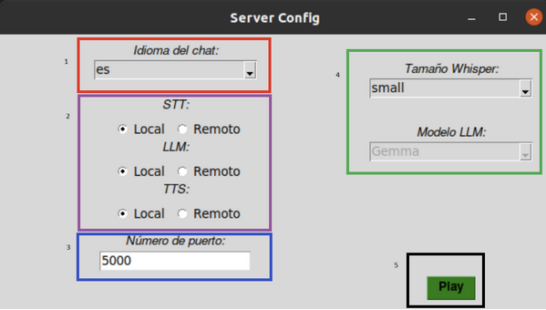

<h2>¿Cuál es la finalidad de este asistente?</h2>

Este asistente se creó para evaluar la competencia lingüística de las personas. Para ello, realiza una serie de preguntas en el 
idioma deseado y, posteriormente, emite una evaluación en función de sus respuestas.

<h2>¿Cómo funciona el asistente?</h2>

El asistente no hace uso de modelos multimodales; en su lugar, crea una pipeline de tratamiento de los datos para poder extraer la información
de los mensajes de voz y poder contestar en el mismo formato.

  

<h2>Características del asistente</h2>
<ul>
  <li><h3>Versión local y remota de los modelos</h3></li>
  
Todos los modelos usados tienen una versión remota y una versión local. Esto ayuda al control de costes y a la protección de la información.

  <li><h3>Funciona con varios idiomas</h3></li>
  
El sistema actualmente funciona en español, inglés y alemán.

  <li><h3>Facilidad de configuración</h3></li>
  
El sistema tiene la posibilidad de elegir la configuración con una interfaz gráfica.

  

    
  

  <li><h3>Comunicación mediante API REST</h3></li>
  
Sigue los estándares de las APIs REST.

  <li><h3>Facilidad de adaptación</h3></li>
  
El sistema es fácilmente adaptable tanto a nuevos modelos como a nuevas áreas de evaluación debido al uso intensivo de interfaces para abstraer las diferentes funcionalidades.

</ul>
  

    
  

<h2>Demo</h2> 

Se incluyen scripts para el uso del servidor desde C#, idean para unity

A continuacion se muestra un programa de prueba que hace uso del servidor que se encuentra en este repositorio

